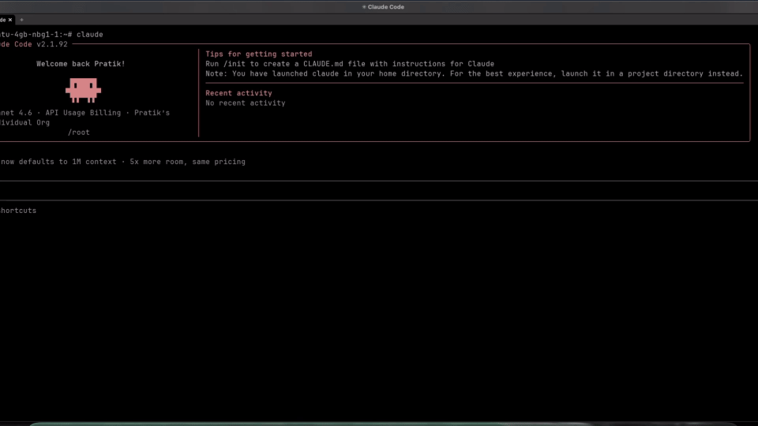

# 🎓 The Interview Mentor

> **AI-Powered Interview Preparation for Software Engineers**

A collection of specialized AI skills for Claude Code and other agentic solutions to help you prepare for software engineering interviews at top tech companies.



---

## 🌟 What is this?

**The Mentor** is an open-source repository of AI interviewers—specialized prompts and instructions that transform your AI coding assistant into an expert technical interviewer. Each "skill" represents a different interview domain, difficulty level, and role type.

### Why Use The Mentor?

- 🎯 **Role-Specific Practice**: Interviewers tailored for SWE-I, Data Engineer, Frontend, Backend, and more
- 🔄 **Adaptive Difficulty**: Questions adjust based on your performance
- 💡 **Intelligent Hints**: 4-level hint system when you get stuck
- 📊 **Visual Explanations**: ASCII diagrams and Remotion video components for complex concepts
- 📈 **Progress Tracking**: Know exactly where to improve
- 🎭 **Realistic Personas**: Interviewers with distinct styles and approaches

---

## 🚀 Quick Start

### Step 1: Download the Repository

Clone the repository:

```bash
git clone https://github.com/ps06756/The-Mentor.git
```

Or download the ZIP manually from GitHub.

### Step 2: Use with Claude Code (Recommended)

Open Claude Code and run:

```
/plugin marketplace add <path_to_the_cloned_folder>/agents
```

Then start practicing with any skill:

> *"Can you help me prepare for a system design interview?"*

> *"I want to practice SQL optimization."*

> *"Help me prepare for a distributed systems interview."*

The agent will take over and conduct a realistic mock interview.

### Option 2: Use with Other AI Assistants

Each skill is a markdown file with clear instructions. Copy the content of any [SKILL.md](./agents/systems-design/url-shortener-interviewer/SKILL.md) file and paste it into your AI assistant of choice (ChatGPT, Claude.ai, etc.)

### Option 3: Create Your Own Skill

1. Copy [templates/skill-template/](./templates/skill-template/)
2. Fill in your topic, role, and questions
3. Add it to the appropriate `agents/` directory
4. Submit a PR!

---

## 📚 Roster

### 🌱 Entry Level (SWE-I / SWE-Intern)

| Skill | Topic | Difficulty | Description |
|-------|-------|------------|-------------|
| [Arrays & HashMaps](./agents/swe-i/arrays-hashmaps-interviewer/SKILL.md) | Data Structures | Easy-Medium | Frequency counting, prefix/suffix products, sliding window |
| [Linked Lists](./agents/swe-i/linked-lists-interviewer/SKILL.md) | Data Structures | Easy | Reversal, merging, cycle detection, fast/slow pointers |
| [Binary Trees](./agents/swe-i/binary-trees-interviewer/SKILL.md) | Trees | Easy-Medium | Traversals, BFS/DFS, BST validation |
| [Recursion & Backtracking](./agents/swe-i/recursion-basics-interviewer/SKILL.md) | Algorithms | Easy | Call stacks, base cases, backtracking |
| [Stacks & Queues](./agents/swe-i/stacks-queues-interviewer/SKILL.md) | Data Structures | Easy-Medium | Monotonic stack, expression evaluation |

### 🚀 Mid Level (SWE-II / Backend / Frontend)

| Skill | Topic | Difficulty | Description |
|-------|-------|------------|-------------|
| [Graph Algorithms](./agents/swe-ii/graph-algorithms-interviewer/SKILL.md) | Algorithms | Medium | BFS, DFS, implicit graphs, union-find |
| [Dynamic Programming](./agents/swe-ii/dynamic-programming-interviewer/SKILL.md) | Algorithms | Medium-Hard | Memoization, tabulation, knapsack, LCS |
| [Heaps & Priority Queues](./agents/swe-ii/heap-priority-queue-interviewer/SKILL.md) | Data Structures | Medium | Top-K, merge K sorted, median stream |
| [URL Shortener](./agents/systems-design/url-shortener-interviewer/SKILL.md) | System Design | Medium | Capacity estimation, hashing, caching, analytics |
| [Rate Limiter](./agents/systems-design/rate-limiter-interviewer/SKILL.md) | System Design | Medium | Token bucket, sliding window, Redis atomicity |

### 🏗️ Specialized Roles

#### Data Engineer

| Skill | Topic | Difficulty | Description |
|-------|-------|------------|-------------|
| [SQL Optimization](./agents/data-engineer/sql-optimization-interviewer/SKILL.md) | Database | Medium-Hard | EXPLAIN plans, composite indexes, partitioning |
| [Pipeline Architect](./agents/data-engineer/pipeline-architect-interviewer/SKILL.md) | Data Engineering | Medium-Hard | Kafka/Flink, Airflow DAGs, exactly-once, late arrivals |
| [Schema Design](./agents/data-engineer/schema-design-interviewer/SKILL.md) | Data Engineering | Medium-Hard | Star schemas, SCDs, grain, lakehouse architecture |

#### Systems Architecture & Distributed Systems

| Skill | Topic | Difficulty | Description |
|-------|-------|------------|-------------|
| [Database Architecture](./agents/systems-design/database-architecture-interviewer/SKILL.md) | Databases | Medium-Hard | SQL vs NoSQL, B-Trees vs LSM, ACID, sharding |
| [Caching Architecture](./agents/systems-design/caching-architecture-interviewer/SKILL.md) | Caching | Medium-Hard | Cache-aside, write-through, thundering herd, bloom filters |
| [API Design](./agents/systems-design/api-design-interviewer/SKILL.md) | API Design | Medium | REST, pagination, versioning, idempotency, OAuth |
| [Message Queues](./agents/systems-design/message-queues-interviewer/SKILL.md) | Messaging | Medium-Hard | Kafka vs RabbitMQ, exactly-once myth, dead letter queues |
| [Microservices Architecture](./agents/systems-design/microservices-architecture-interviewer/SKILL.md) | Architecture | Medium-Hard | DDD, sagas, circuit breakers, service boundaries |
| [Distributed Systems Core](./agents/systems-design/distributed-systems-interviewer/SKILL.md) | Dist. Systems | Hard | CAP theorem, quorums, Raft, vector clocks, fencing tokens |
| [Networking & Load Balancing](./agents/systems-design/networking-load-balancing-interviewer/SKILL.md) | Networking | Medium-Hard | L4/L7 LBs, TLS termination, consistent hashing |
| [Reliability & Observability](./agents/systems-design/reliability-observability-interviewer/SKILL.md) | Reliability | Medium-Hard | Circuit breakers, SLOs, exponential backoff with jitter |

#### DevOps / SRE

| Skill | Topic | Difficulty | Description |
|-------|-------|------------|-------------|
| [Kubernetes](./agents/devops-sre/kubernetes-interviewer/SKILL.md) | Infrastructure | Medium | Pods, deployments, HPA, CrashLoopBackOff debugging |
| [CI/CD Pipeline](./agents/devops-sre/cicd-pipeline-interviewer/SKILL.md) | DevOps | Medium | Blue-green, canary, database migrations in CI |
| [Monitoring & Alerting](./agents/devops-sre/monitoring-alerting-interviewer/SKILL.md) | SRE | Medium | SLOs, burn-rate alerts, alert fatigue |

#### Machine Learning Engineer

| Skill | Topic | Difficulty | Description |
|-------|-------|------------|-------------|
| [ML System Design](./agents/ml-engineer/ml-system-design-interviewer/SKILL.md) | ML Engineering | Hard | Feature stores, model serving, A/B testing, drift |
| [Deep Learning](./agents/ml-engineer/deep-learning-interviewer/SKILL.md) | ML Theory | Hard | Transformers, training dynamics, convergence debugging |

#### AI Product Management

| Skill | Topic | Difficulty | Description |
|-------|-------|------------|-------------|
| [AI Product Strategy](./agents/ai-pm/ai-product-strategy-interviewer/SKILL.md) | AI PM | Hard | When to use AI, success metrics, ship-vs-wait decisions |
| [Prompt Engineering](./agents/ai-pm/prompt-engineering-interviewer/SKILL.md) | AI PM | Hard | RAG architecture, evaluation frameworks, token optimization |
| [Responsible AI](./agents/ai-pm/responsible-ai-interviewer/SKILL.md) | AI PM | Hard | Bias mitigation, content moderation, EU AI Act |

#### Debugging & Incident Response

| Skill | Topic | Difficulty | Description |
|-------|-------|------------|-------------|
| [Broken API](./agents/debugging/broken-api-interviewer/SKILL.md) | Debugging | Medium-Hard | 500 errors under load, connection pools, deadlocks |
| [Slow Database](./agents/debugging/slow-database-interviewer/SKILL.md) | Debugging | Medium-Hard | Query regression, stale statistics, lock contention |
| [Memory Leak](./agents/debugging/memory-leak-interviewer/SKILL.md) | Debugging | Medium-Hard | Unbounded caches, listener leaks, OOM debugging |
| [Cascading Failure](./agents/debugging/cascading-failure-interviewer/SKILL.md) | Debugging | Hard | Thread pool exhaustion, retry storms, missing circuit breakers |
| [Data Inconsistency](./agents/debugging/data-inconsistency-interviewer/SKILL.md) | Debugging | Hard | Timezone mismatches, duplicate events, reconciliation |
| [Deployment Rollback](./agents/debugging/deployment-rollback-interviewer/SKILL.md) | Debugging | Medium-Hard | Failed deploys, incompatible migrations, feature flags |

### 👑 Senior+ Level (SWE-III / Senior / Staff)

| Skill | Topic | Difficulty | Description |
|-------|-------|------------|-------------|
| [Design Uber](./agents/systems-design/uber-interviewer/SKILL.md) | System Design | Hard | Geospatial indexing, real-time matching, concurrency |
| [Design Twitter](./agents/systems-design/twitter-interviewer/SKILL.md) | System Design | Hard | Fan-out on write vs read, timeline ranking |
| [Design a Search Engine](./agents/systems-design/search-engine-interviewer/SKILL.md) | System Design | Hard | Crawling, inverted index, TF-IDF, autocomplete |
| [Leadership Principles](./agents/behavioral/leadership-principles-interviewer/SKILL.md) | Behavioral | All Levels | STAR method, ownership, cross-functional collaboration |
| [Problem Decomposition](./agents/meta/problem-decomposition-interviewer/SKILL.md) | Meta | All Levels | How to approach any unknown problem — pattern recognition, structured thinking |

---

## 🎯 How It Works

### Skill Structure

Each skill follows a consistent format:

```
🎭 Persona
   └── Who the AI interviewer is, their style, approach

🎯 Core Mission
   └── What you'll learn and practice

📋 Interview Structure
   └── Phases: Warm-up → Core Concepts → Problem Solving → Wrap-up

🔧 Interactive Elements
   └── ASCII diagrams, Remotion components for visual learning

💡 Hint System
   └── 4 levels: Gentle nudge → Direction → Partial solution → Full walkthrough

📝 Problem Bank
   └── Curated questions with optimal solutions and follow-ups

🏆 Evaluation Rubric
   └── How to assess performance and identify weak areas

📚 Resources
   └── Books, courses, and practice problems for further study
```

### Hint System Explained

When you're stuck, the interviewer provides hints at increasing detail levels:

| Level | Type | Example |
|-------|------|---------|
| **1** | Gentle Nudge | *"Think about the time complexity. What data structure gives O(1) lookups?"* |
| **2** | Direction | *"This sounds like a dynamic programming problem. Can you identify the subproblems?"* |
| **3** | Partial Solution | *"Try using two pointers - one at start, one at end, moving towards each other."* |
| **4** | Full Walkthrough | Step-by-step explanation with pseudocode |

**Pro tip**: Try to solve with Level 1 hints first. The struggle is where learning happens!

---

## 🎨 Visual Learning

### ASCII Diagrams

Every skill includes visual explanations:

```
Two Pointers Pattern:
Array: [1, 2, 3, 4, 5, 6], Target: 7

Left →                    ← Right
  1     2  3  4  5     6
  1+6=7 ✓ Found!
```

### Remotion Components

For complex animations, we provide [Remotion](https://www.remotion.dev/) React components:

```tsx
// Example: Visualizing consistent hashing
export const ConsistentHashingDemo = () => {
  const frame = useCurrentFrame();
  // Animation logic...
  return <div>{/* Visual representation */}</div>;
};
```

Render these to video for:
- Pre-study review
- Sharing explanations with study groups
- Building your own tutorial content

---

## 🛠️ For Contributors

### Adding a New Skill

1. **Fork the repository**
2. **Copy the template**:
   ```bash
   cp -r templates/skill-template agents/{category}/{skill-name}-interviewer
   ```
3. **Fill in the template** following our guidelines
4. **Test your skill** with Claude Code
5. **Submit a PR** with:
   - Clear description of what the skill covers
   - Test notes (how you verified it works)
   - Any Remotion components included

### Skill Quality Checklist

- [ ] Clear, consistent persona defined
- [ ] 3-4 difficulty-appropriate problems
- [ ] All 4 hint levels for each problem
- [ ] At least 2 visual diagrams (ASCII or Remotion)
- [ ] Evaluation rubric included
- [ ] Resources section with further reading
- [ ] Tested with at least one AI assistant

### Directory Structure

```
The-Mentor/
├── README.md                 # This file
├── LICENSE                   # MIT License
├── templates/
│   └── skill-template/       # Template for new skills
│       ├── SKILL.md
│       └── references/
├── agents/
│   ├── swe-i/                # Entry level
│   ├── swe-ii/               # Mid level
│   ├── systems-design/       # System design interviews
│   ├── data-engineer/        # Data engineering
│   ├── devops-sre/           # Infrastructure
│   ├── ml-engineer/          # ML/AI roles
│   ├── ai-pm/                # AI Product Management
│   ├── debugging/            # Debugging & Incident Response
│   ├── behavioral/           # Behavioral interviews
│   └── meta/                 # Meta skills
├── examples/                 # Example usage sessions
└── docs/                     # Documentation
```

---

## 📊 Interview Preparation Roadmap

### Week 1-2: Fundamentals (SWE-I Level)
- [ ] Arrays & HashMaps
- [ ] Linked Lists
- [ ] Binary Trees
- [ ] Recursion & Backtracking
- [ ] Stacks & Queues

### Week 3-4: Intermediate (SWE-II Level)
- [ ] Graph Algorithms
- [ ] Dynamic Programming
- [ ] Heaps & Priority Queues
- [ ] System Design (URL Shortener, Rate Limiter)

### Week 5-6: Advanced Topics & Specialization
- [ ] System Design (Uber, Twitter, Search Engine)
- [ ] Distributed Systems
- [ ] Specialized role skills (Data Eng, DevOps, ML, etc.)
- [ ] Debugging scenarios

### Week 7+: Mock Interviews & Behavioral
- [ ] Full mock interviews using combined skills
- [ ] Leadership Principles (behavioral)
- [ ] Problem Decomposition (meta skill)

---

## 📖 Example Session

**You**: *"Help me prepare for a system design interview on URL Shortener"*

**Claude**: [Loads skill persona]

> 🎓 **URL Shortener Interviewer**
>
> Welcome! I'm here to evaluate your system design skills. We'll design a URL shortening service like bit.ly together.
>
> Let's start: What are the functional requirements? What would be a reasonable scale to design for?

**You**: *"We need to create short URLs and redirect... maybe 100 million URLs per month?"*

**Claude**: Good start on the scale. Let's dig deeper into the requirements...

[45 minutes of guided design with hints when needed]

**Claude**: Great session! Here's your evaluation:
- Requirements Gathering: 4/5
- Capacity Estimation: 3/5
- Data Model: 4/5
- API Design: 4/5
- Trade-off Analysis: 3/5

**Areas to improve:**
- Consider read vs write ratios for caching strategy
- Think about analytics requirements from the start

---

## 🔗 Related Projects

- [System Design Primer](https://github.com/donnemartin/system-design-primer) - Learn system design
- [NeetCode](https://neetcode.io/) - Practice problems by pattern
- [Blind 75](https://www.teamblind.com/post/New-Year-Gift---Curated-List-of-Top-75-LeetCode-Questions-to-Save-Your-Time-OaM1orEU) - Essential problem list

---

## 📜 License

MIT License - see [LICENSE](./LICENSE) file for details.

Contributions welcome! Please read our [Contributing Guide](./CONTRIBUTING.md).

---

<p align="center">
  <strong>Ready to ace your next interview?</strong><br>
  Pick a skill from the <a href="#-roster">Roster</a> and start practicing!
</p>

<p align="center">
  ⭐ Star this repo if it helps you land your dream job! ⭐
</p>
